**Code Institute Milestone Project 4**

**Fullstack Frameworks with Django**

# **Your EDC Shop**

EDC = Every Day Carry

**Pocket tools for daily Urban Survival**

**Background &amp; Objective**

**1.1 Background / Problem Statement**

- This project is to demonstrate the how a fullstack framework using Django can create a simple yet elegant e-commerce site for a niche retailer YOUR EDC SHOP, who specializes in pocket tools and paraphernalia for the &quot;EDC&quot; Community.
- EDC stands for Every Day Carry – alluding to handy tools and apparel one uses daily
- It is also a lifestyle of certain communities such as doomsday preppers, law enforcement and emergency medical professionals, urban survivalists, tool aficionados.
- There is a need to have an online presence to showcase new products and equipment reviews

**1.2 Objective**

- Design and build a store for YOUR EDC SHOP
- The client requires:
  1. A mobile responsive store front-end with landing page
  2. Checkout and payment functions
  3. Ability to Display products currently in their inventory
  4. A database to store products/transactions
  5. A secure payment gateway for purchases

**2. Beta Site Demo**

The beta site is hosted via Heruku via [**https://edcshop-kev4.herokuapp.com/**](https://edcshop-kev4.herokuapp.com/)

The site&#39;s github repository can be found at https://github.com/baguamaster/Your-EDC-Shop

**3. Technologies Utilised**

- HTML
- CSS
- Bootstrap 4
- Django
- Django All Auth
- Django Crispy Forms plugin
- Stripe (gateway to secure checkout and payments)
- [UploadCare](https://uploadcare.com/) (for image upload and cloud storage)

**3.1 Dependencies installed with pip (python&#39;s package manager)**

- python-dotenv
- stripe
- dj\_database\_url
- django
- django-allauth
- django-crispy-forms
- pyuploadcare

**3.1.1 Installations for Heroku deployment**

- pip3 install gunicorn
- pip3 install psycopg2
- pip3 install Pillow
- pip3 install whitenoise

**4. The Goals: Agile User Stories**

For the EDC-themed e-business to directly sell to customers instead of through a portal like amazon prime etc:

1. Enable Product Listing capabilities, so that customers can see product pictures and the prices of items in inventory items

2. Allow customers to read reviews and make informed purchases in the store

3. Allow standard CRUD functions for all product listings

4. Allow categorization of products by specific groups

5. Provide mobile-responsivity to the website so customers can view on any browser platform

6. Enable secure shopping cart and payments

7. Have a membership joining function to enable collection of delivery addresses for handing off to the logistics agent

8. Allow customer reviews on the website, to encourage stickiness

7. Enable active management of inventory so that out of stock items are reflected accordingly

8. Allow customers to do simple searches for products

9. Allow hassle-free straight-thru-processing secure payments

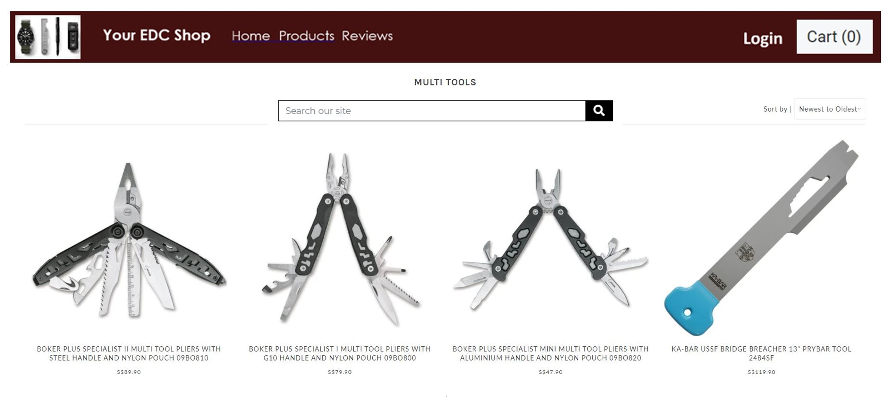

**5. Key Features**

**5.1 Feature List**

The following features were engineered into the original website design:

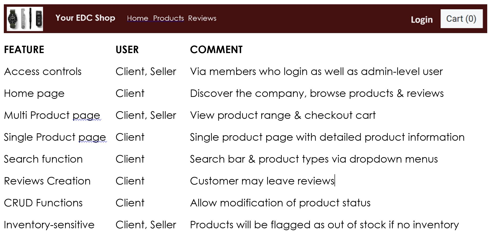

**6. Database Design**

Database architecture proceeded from and original Entity Relationship (ER) diagram design, following which led to a Logical Schema Diagram when granularity was required at the model-construction phase.

**6.1 Entity Relationship (ER) Diagram**

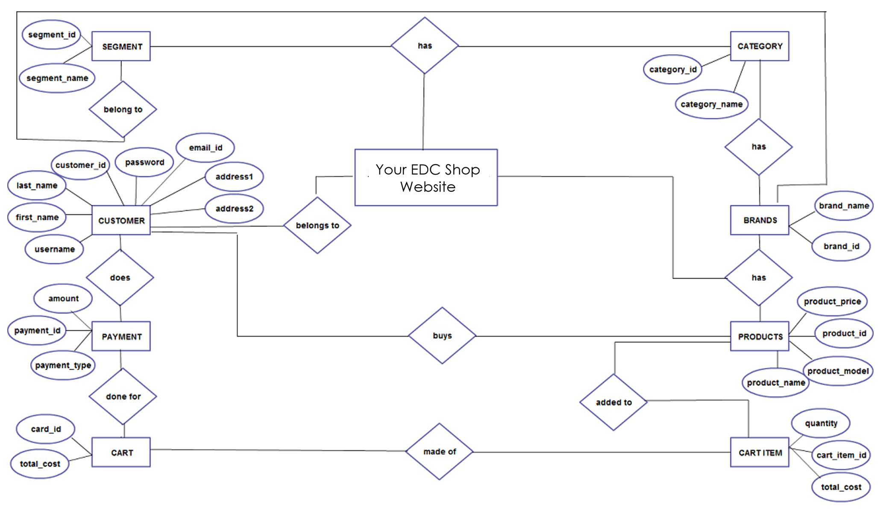

**6.1 Logical Schema Diagram**

When greater detail and relationship were called for, the Logical Schema Diagram was created to establish model relationships.

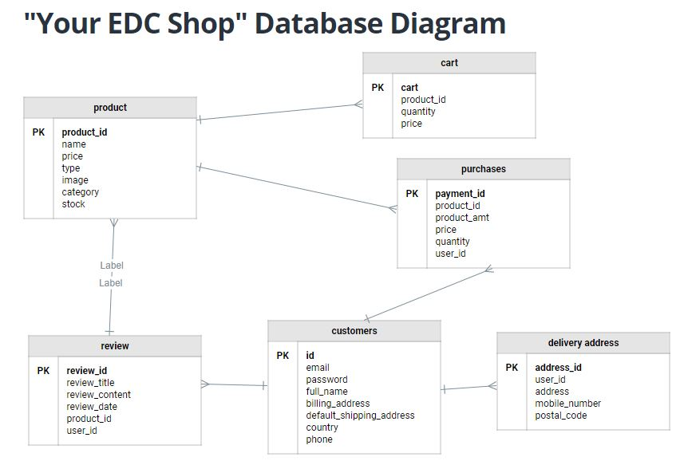

The Logical schema was engineered to incorporate the following tables (models) and done with the aid of moqup.com:

1. Products
2. Reviews of each product
3. User
4. Purchase Details
5. Delivery Address

**6. Prototyping**

Initial wireframing was done up on MS word to mock-up the features of the website.

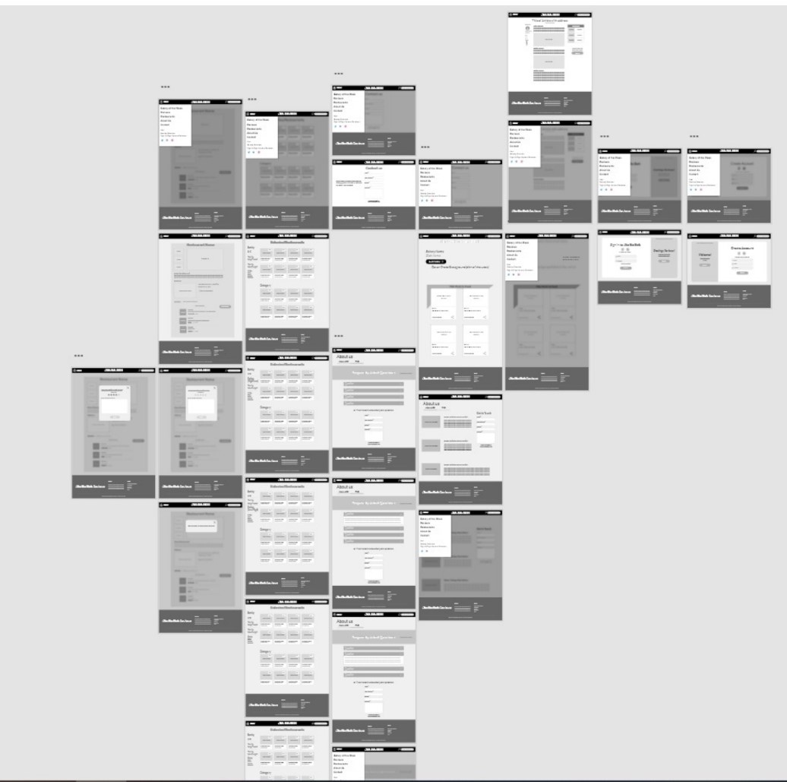

**6.2 Actual Final Design**

The final design and UI was engineered to dovetail with the agile user stories to meet client objectives:

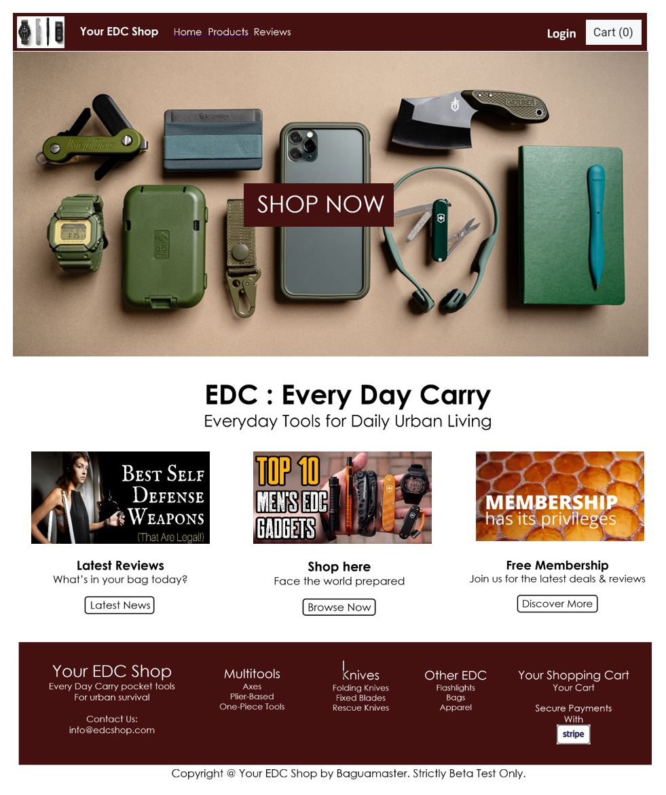

**6.2.1 Product page**

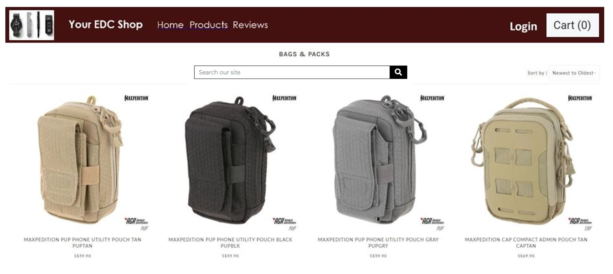

In order to facilitate being able to see inventory in stock, a Django template was used to list all products from the database a &quot;For Loop&quot; action was used to extract the products from product model via identification of product id.

**6.2.3 Search Function**

Each page also has a sort function found in the drop down menu on the top right hand of the page

- Search from products listings page is implemented as a query from django.db.models import Q
- An object query = ~Q(pk\_\_in=[]) was insert to always remain true
- In the search function (found on product listings page), Query parameters were passed via the GET method to show\_products to perform filtering and display

**6.2.4 Single Products Display**

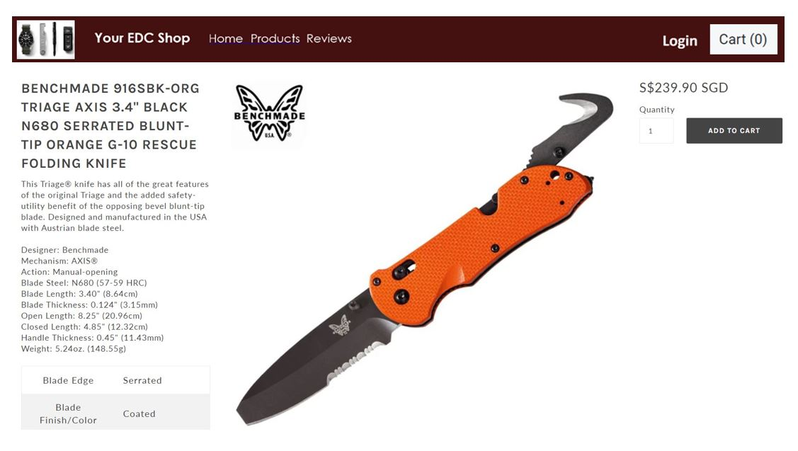

- This type of page displays a particular product and the more information on that product
- There is a view to the cart

**6.2.5 Reviews Creation**

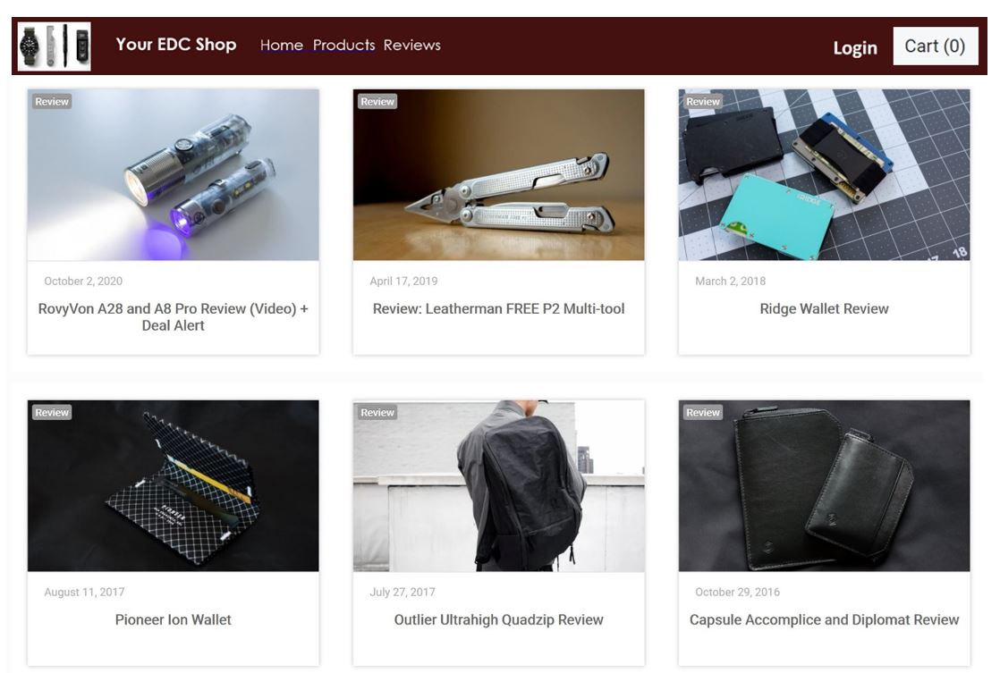

Review function is enabled via:

- implementing using forms.py to display review model fields
- post form submission, the user will be redirected back to the product details page.
- no updating or deleting route is needed since buyers will not be given the option to change their reviews.
- Administrator can still remove the reviews directly from django-admin if needed

**6.2.6 Product CRUD**

In order to list products so that users can see the pictures and the price of items, a standard CRUD model is imposed on the product listings

- CRUD functions implemented using products/views.py view functions.
- ne function is used for each operation
- This Product CRUD function is only usable by admin who is the Seller
- All other user types will be shown an &quot;access denied&quot; message

**6.2.6.1 Image uploading using UploadCare**

- Uploadcare (https://uploadcare.com/) is used to handle uploading of images for product create.
- The image cdn url is stored and rendered in the img src of each product card

**6.2.7 Access Controls**

- Access controls are implemented using django all auth decorator for @login

**6.2.8 Cart**

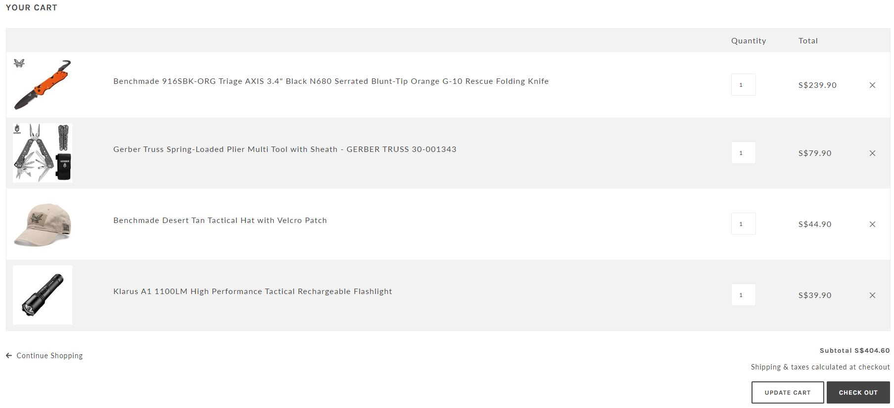

- Cart is implemented using django sessions
- Backend values were stored in sessions as strings or float and displayed via cart/templates using the view\_cart function.
- &quot;Update&quot; function will extract sessions storage and update the array with requests from the update quantity form input
- Users cannot update quantity to zero, user may remove item from the cart instead, to prevent downstream conflicts.

**6.2.9 Checkout**

- Secure payment is processed by stripe at checkout
- After checkout success, the user will be redirected to STRIPE\_SUCCESS\_URL
- Payment metadata is used to create &quot;Purchases&quot; model.
- &quot;Purchases&quot; enables order processing and fulfillment of the deliveries based on the address that was collected earlier.

**7. Environment setup**

**7.1**

- The following were used in the .env file during development.
- For Heroku, these are stored under Heroku settings \&gt; Config vars
- These values were then passed to settings.py via os.environ.get()

# for uploadcare:

UPLOADCARE\_PUBLIC\_KEY

UPLOADCARE\_SECRET\_KEY

# for stripe payment

STRIPE\_PUBLISHABLE\_KEY

STRIPE\_SECRET\_KEY

STRIPE\_SUCCESS\_URL

STRIPE\_CANCEL\_URL

STRIPE\_ENDPOINT\_SECRET

# linking to database on heroku

DATABASE\_URL

# sending email via gmail

EMAIL\_HOST\_PASS

EMAIL\_HOST\_USER

TEST\_EMAIL

**8. Technologies Applied**

- **HTM5**  to structure the webpages and  **CSS3**  to style them.

- **JavaScript to run functions**
- **Python 3.7 via the Flask framework to drive database functions**
- **MySql for database management**
- **Git** for Versioning Control System and  **GitHub**  for repositories.
- **Bo**** otstrap 4.5 ****, including its components and utilities for layout. Key elements favoured:**
  - NavBar is used for the main navigation,
  - Distinct images are used as attention grabber
  - Jumbotron is used for carrying the call to action button
  - CSS Stylesheet from w3newbie ([https://w3newbie.com/responsive-html5-web-design-tutorial-and-free-template-code/](https://w3newbie.com/responsive-html5-web-design-tutorial-and-free-template-code/))
  - Code Institute&#39;s templates ([https://github.com/Code-Institute-Org/gitpod-full-template](https://github.com/Code-Institute-Org/gitpod-full-template)) to start the coding.
  - The template used for Readme.md is also from Code Institute ([https://github.com/Code-Institute-Solutions/readme-template/blob/master/README.md](https://github.com/Code-Institute-Solutions/readme-template/blob/master/README.md))

**9.External tools used**

**9.1 Other Tools are also used in the course of development:**

  - For validating JavaScript:
    - JShint validator ([https://jshint.com/](https://jshint.com/))
  - For validating markup:
    - W3 Markup Validator ([http://validator.w3.org/](http://validator.w3.org/))
  - For validating CSS:
    - W3 Jigsaw Validator ([https://jigsaw.w3.org/css-validator/](https://jigsaw.w3.org/css-validator/))
  - For checking links:
    - W3C Link Checker ([https://validator.w3.org/checklink](https://validator.w3.org/checklink))
  - For image editing
    - Adobe Lightroom ([https://lightroom.adobe.com/](https://lightroom.adobe.com/))
  - For responsiveness:
    - Responsive Web Design Checker ([https://responsivedesignchecker.com/](https://responsivedesignchecker.com/))
  - For mindmapping:
    - Mindup mind mapper ([https://www.mindmup.com/](https://www.mindmup.com/))
  - For UX readability:
    - Flesch-Kincaid readability test ([https://www.webfx.com/tools/read-able/](https://www.webfx.com/tools/read-able/))
  - For UX viewing on various device formats:
    - Responsinator: ([https://www.responsinator.com/](https://www.responsinator.com/))
  - For Logical Schema Diagram:
    - moqups.com

**10. Testing**

**10.1 Code Validation using Code Validators**

- static/style.css was validated using the W3C Jigsaw validator
- all .html files in templates was validated using the W3 Nu HTML Validator

**10.2 PEP8 Style guide for Python**

All code in .py files comply with PEP8 [Style guide](https://www.python.org/dev/peps/pep-0008/)

This is ensured by making sure no callouts from gitpod python linter are present in app.py and that no lines of code in app.py exceed 79 Characters

**10.2 Testing and Bug Fixes (Test Case Table)**

Manual testing was conducted to ensure Usability, Functionality and Responsiveness

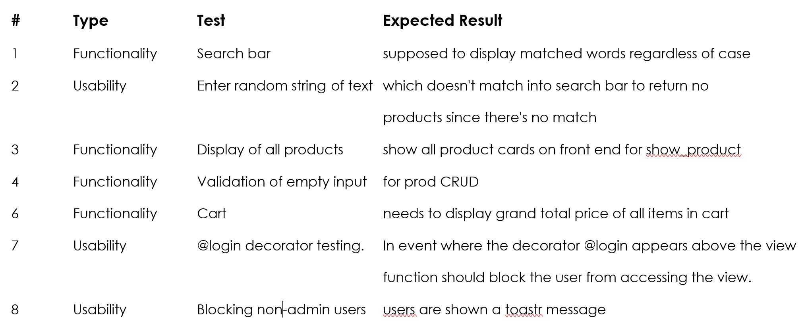

**11. Deployment**

**Preparation**

All major changes were committed on Visual Code Studio as an independent instance and ported over to gitpod and Heroku via github towards deadline.

**Content**

- Ensured all the last changes were saved and committed.
- Committed final Heroku Push
- Committed a final Git Push
- Latest deployment enabled

**11.1 Preparation**

**Things to check**

1. set debug=False!!! since we are going into production and no longer in development
2. Ensure that settings.py allowed hosts do not have \*
3. Do not upload the .env file

Before the site goes live the following elements are checked gitpod&#39;s native browser preview via open port 8000. This is done by executing command in terminal python3 manage.py runserver

- Fulfillment of Learning objectives from &#39;Code Insitutes&#39; Assessment Handbook`
- Check all code linters and validators are clear
- Check that all images src are not broken
- Test viewport dynamic resizing for android (Samsung S9) and iOS (iPhone X/XS)
- Check Create, Read, Display, Update, Delete functions for Product
- Check all forms.py and form validation correspond to the underlying models.py
- Ensure all entries and details from db are properly rendinging
- Check navbar functionality and responsiveness

**Git Version Control Pages**

- https://github.com/baguamaster/Your-EDC-Shop

**Demo Website (Deployed via Heroku)**

- [**https://edcshop-kev4.herokuapp.com/**](https://edcshop-kev4.herokuapp.com/)

**12. Acknowledgements**

**12.1 General Acknowledgements:**

- Mr Malcolm Yam – UI &amp; Bootrap instructor
- Mr Arif Rawi - HTML and CSS instructor
- Mr Paul Kunxin Chor – The main instructor who saw us through the hardest technical areas
- Mr Ace Liang - Teaching support and troubleshooter
- Classmates for the lively discourse and discovery sharing
